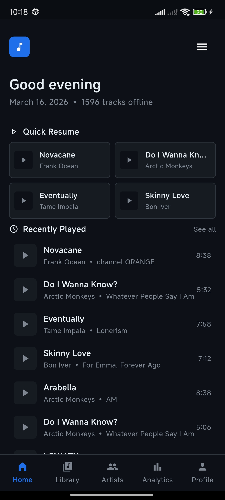
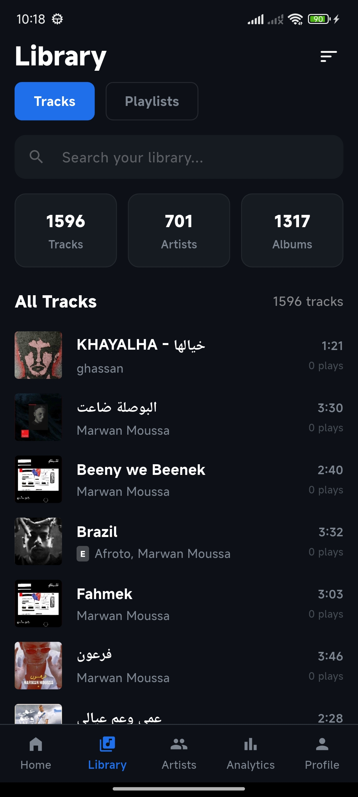
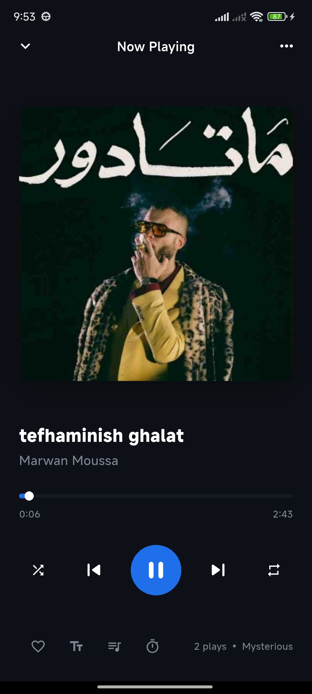
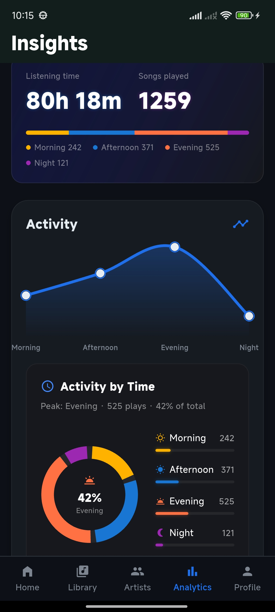
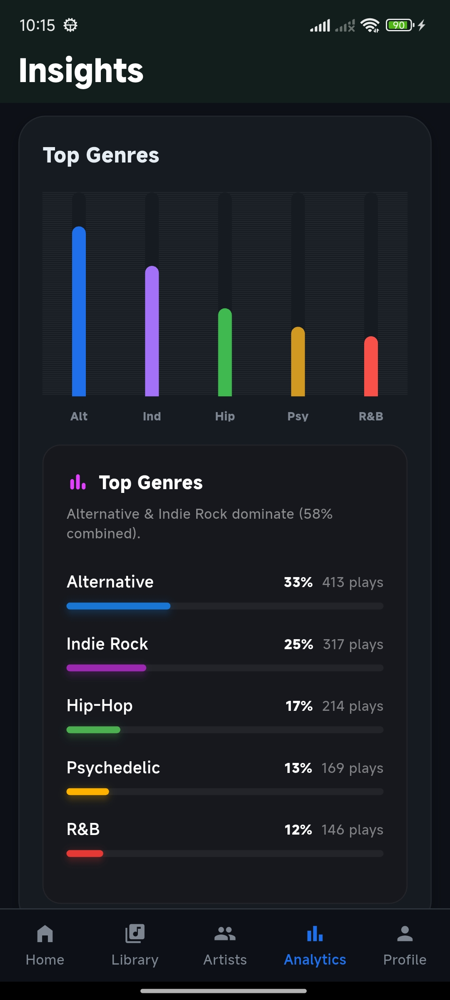
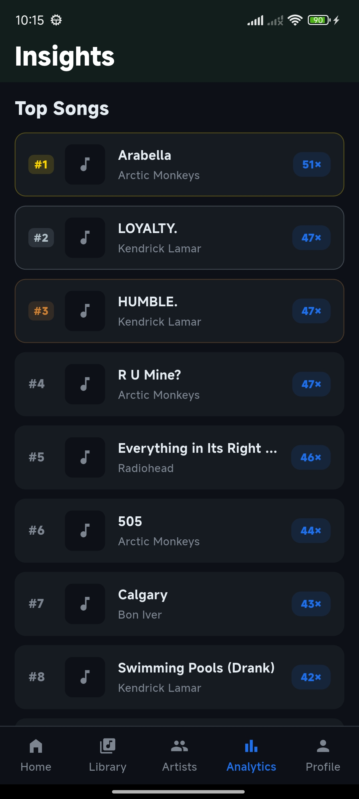
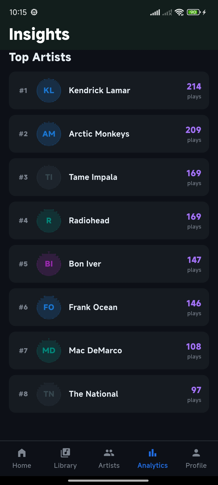

<div align="center">

# Osserva

**A local music player that actually knows how you listen.**


</div>

---

Osserva is an offline Android music player built around one idea: your listening habits deserve the same depth of analytics that streaming services give you — without sending your data anywhere.

Play counts, activity heatmaps, time-of-day distributions, per-artist breakdowns — all computed locally, all stored on your device.

---
## Screenshots

<p float="left">
  
  
  
  
  
  
  
</p>

## Features

### Playback
- Seamless background playback with lock-screen and notification controls
- Full-screen player with queue manager and sleep timer
- Android 13+ permission handling (`READ_MEDIA_AUDIO`)

### Analytics
- Play counts, top artists, top albums, top genres — all local
- Activity heatmap and time-of-day listening distribution
- Per-artist drill-down and complete playback history
- All timestamps anchored to local midnight for accurate daily stats

### Library
- Offline playlist creation, editing, and per-song management
- Persistent favorites
- Metadata editor with custom artwork injection

---

## Architecture

Osserva uses **Feature-First Clean Architecture** with BLoC for state management.

```
lib/
├── core/               # DI, routing, theme, shared use cases
└── features/
    ├── analytics/      # Stats engine, heatmaps, play log recording
    ├── artists/        # Per-artist views and drill-down
    ├── favorites/      # Persistent favorites management
    ├── home/           # Main shell and navigation
    ├── library/        # Local media scanning and sorting
    ├── music_player/   # Audio playback, queue, and background service
    ├── onboarding/     # First-launch flow and permissions
    ├── playlists/      # Offline playlist CRUD
    └── profile/        # Settings and preferences
```

Each feature owns its own `data`, `domain`, and `presentation` layers. Cross-feature dependencies go through `core`. See [`docs/architecture.md`](docs/architecture.md) for a full breakdown.

---

## Tech Stack

| Layer | Package | Notes |
|---|---|---|
| State Management | `flutter_bloc` | Predictable, testable state across all features |
| Dependency Injection | `get_it` | Service locator; features register their own modules |
| Navigation | `auto_route` | Strongly-typed, declarative routing |
| Audio Playback | `just_audio` + `audio_service` | Core engine + background service handler |
| Media Querying | `on_audio_query` (forked) | Optimized local media retrieval |
| Database | `sqflite` | SQLite for analytics (star schema, daily rollups) |
| Error Handling | `fpdart` | `Either` types throughout the domain layer |
| Models | `freezed` | Immutable, sealed union data classes |
| Charts | `fl_chart` | Analytics visualizations |

---

## Getting Started

**Requirements**
- Flutter stable ≥ 3.10.0
- Android device or emulator (min API 21)

```bash
# 1. Clone
git clone https://github.com/your-username/osserva.git
cd osserva

# 2. Install dependencies
flutter pub get

# 3. Generate Freezed, AutoRoute, and Injectable files
dart run build_runner build --delete-conflicting-outputs

# 4. Run
flutter run
```

---

## Troubleshooting

**`Missing concrete implementation` or `isn't defined` errors**

Generated files are missing or stale. Re-run:
```bash
dart run build_runner build --delete-conflicting-outputs
```

**Permission denied (`READ_MEDIA_AUDIO`)**

Accept the system prompt on first launch. If denied, go to **Settings → Apps → Osserva → Permissions** and grant Audio access manually.

**Background playback fails in a release APK**

Ensure `android/app/src/main/res/raw/keep.xml` is present in your project. R8 silently strips `audio_service` classes that are only referenced via runtime string lookups — this file contains the AAPT keep directives that prevent it. Without it, background playback and notifications will fail in release builds only.

---

## Platform Support

| Platform | Status |
|---|---|
| Android | ✅ Fully supported |
| iOS | ⚠️ Scaffolded — not tested on a physical device |

---

## Known Limitations

- BLoC unit test coverage is actively being expanded; some features are not yet covered.
- iOS builds are not production-ready.

---

## Contributing

Issues and pull requests are welcome. If you find a bug, please open an issue with steps to reproduce. For feature requests, open an issue before submitting a PR to align on direction.

---

## License

MIT License — see [`LICENSE`](LICENSE) for details.
